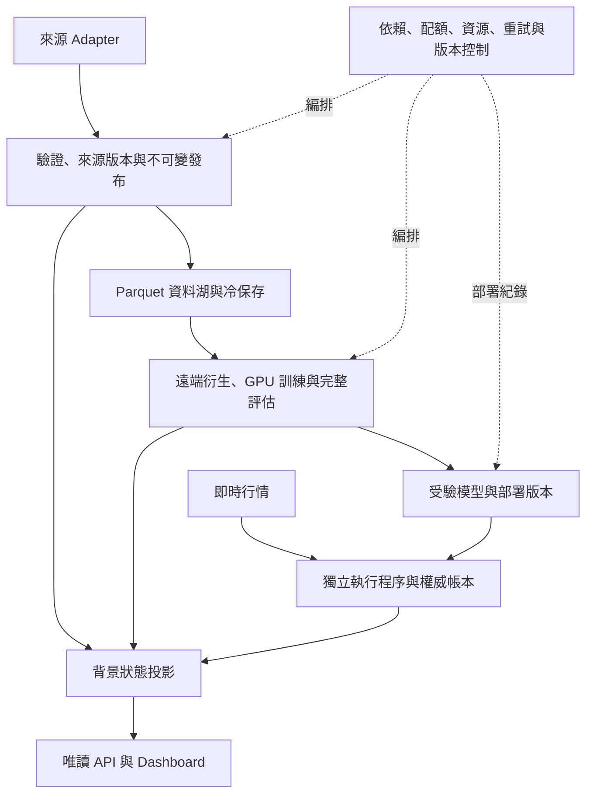

# 第一性原理架構分析與現代化開發

使用者在 2026-10-02 要求先分析、2026-10-03 授權記錄分析並完整開發、測試及
優化。工程任務為 `modernize-architecture-20261003`；原始範圍與每個 milestone
保存在既有 agent workflow，不以單項修正代替全系統完成。

本輪工程驗收完成：固定版本 Python 全套 12,736 passed／65 skipped／1 xfailed，
前端 71 項通過，五次完整雙 GPU fold、逐位元 parity 與 914 檔發布驗收完成。
監控快取子流程採用 msgspec 後 wall time 少 13.97%；CPU16 profile 保留相近
吞吐和較低配置預算。現存服務、來源一致性、既有診斷缺陷與測試事件的部分
產物恢復仍有下文所列界線。機器可讀的
[總驗收摘要](../artifacts/operations/architecture-modernization-20261003/modernization-acceptance.json)
保存版本、測試、候選選擇及 25 份證據雜湊。

後續的收益缺陷、來源一致性、服務與事故恢復進度記錄於
[架構現代化續作與服務驗收](architecture_readiness_repair_2026-10-03.md)。
下文的未修復／失敗／部分恢復描述是原輪驗收時的狀態，後續結果另附證據，
不改寫這份固定版本的歷史測試或 GPU parity。

## 目標與不可變的責任

規劃假設為未來 12–24 個月的多來源、遠端多 GPU 研究與盤中服務。效率以
每個 API 成本單位補進的真實缺口、完整可重現 fold/GPU-hour、更新放大率、
盤中延遲與恢復人工成本衡量。程式仍維持共用 repository、collector、trainer、
checkpoint、execution、publication 與服務入口；依責任拆模組，依時限拆程序。

市場觀測、模型可用時間、決策時鐘、可執行價格和紙上／券商成交維持各自契約。
資料庫的 table snapshot 不會自動證明 PIT。缺口、權限限制、來源空回與完成
必須分開。未通過恢復／引用／pin／lease 守門的源本或 artifact 不會因本計畫退役。

## 分析的證據與界線

2026-10-02 分析快照：17 個 mode、157 份可解析市場 YAML、6 份缺共同 base 的
regression YAML、39 個 catalog dataset、121 個 unit template、66 installed
StockAgent services。這些是不同母集合，不相加。程式入口可由
[architecture audit](../scripts/audit_project_architecture.py) 重新產生。

當時 Linux 可見 16 logical CPUs、約 94 GiB RAM、RTX 5070 Ti 約 16 GiB；根磁碟
使用率約 92%，D 尚有約 2.48 TB 可用。環境匯出列 PyTorch 2.12.1，當時實際
runtime 為 2.13.0。硬體、容量、服務狀態與套件版本均需重新量測。

現有 Parquet／Arrow／Polars／DuckDB 與 mmap 輸入的分工合理，參見
[columnar contract](columnar_storage_architecture.md)。現有
[mode adapter/lifecycle](training_mode_adapter_architecture.md) 已建立產品與
共用訓練外層的責任邊界。`trainer.py` 約 2.9 萬行、OpenBB downloader 約 2.1
萬行是責任拆分的調查入口，行數本身不是效能證據。

[10/2 服務清冊](service_inventory_2026-09-23.md) 記錄正式 per-dataset projection
已部署：固定觀察 ABBA 的 publisher 約 2.657 → 0.548 秒；自然完整 workflow
仍約 8 秒。固定 replay 不含 provider、冷 discovery、公網或 browser paint。
後續優先量測 record decode／聚合／寫入與 public status，保留不一致／partial。

[FinMind 最新報告](finmind_eta_retry_repair_2026-10-02.md) 的長期候選約 7,800 萬
calls。假設每 call 一個成本單位、帳號永遠 6,000/hour，候選計算約 540 天；
這不是缺資料筆數或完工承諾。應先證明可取區間、交易日、標的生命週期與查詢粒度，
再選合批、重用與 concurrency。空回不能被永遠推定成無資料。

過去 physical-FIFO 的某次 epoch 約 48 秒，其中 loss/backtest 約 22 秒；這是
歷史遙測，本次分析未重新 benchmark。Amdahl 計算：若比例 p=45%、該段 s=3
倍，整體理論 1/((1-p)+p/s) 約 1.43 倍。GPU 優化以完整 cold／steady epoch、
formal batch、DDP 最大 rank、完整 fold artifacts 與 resume parity 驗收。

## 技術選擇

| 責任 | 基礎／候選 | 選擇條件 |
| --- | --- | --- |
| 市場事實與 ETL | Parquet、Arrow、Polars、DuckDB | 沿用既有入口；比較真實 full-universe 工作量、RAM 與完整輸出 |
| 本機續傳與邊緣狀態 | SQLite WAL | 短交易、本機單寫者與可恢復 receipts；不要透過同步分享 mutable DB |
| 跨節點工作控制 | PostgreSQL | 多機 claim／lease／release／run 關係確有需求時，與現有流程比較後逐項接入 |
| 多 client 分析表 | DuckLake；多引擎需求另評 Iceberg | 增益需含 catalog 備份、snapshot/release 映射、恢復與維運成本 |
| 長時間跨機工作鏈 | Temporal | Activities 呼叫 canonical collector/trainer；分區續傳仍由原 owner 管理 |
| Python 包裝與版本 | 可安裝 pyproject、角色依賴與 lock | 使用 uv 等工具管理 Python 層；CUDA／原生環境維持受驗且可攜的 runtime discovery |
| API／前端契約 | typed DTO、TypeScript 漸進建置 | 保留唯讀 allowlist、快取、分頁、最後成功資料與正式 browser 驗收 |
| 節點 supervisor | systemd | 即時、下載、衍生、GPU、API 分配資源預算，正式工作不交由 tmux 取代 |

所有候選依相同輸入、正確性、總 wall time、peak RAM/VRAM、I/O 與維運成本決定。
未有跨節點或多引擎需求的元件不會單因較新而啟用。既有正式發布仍是唯一權威；
shadow 或 catalog/view 不得產生第二個市場事實來源。

官方依據：
- [PostgreSQL row locking](https://www.postgresql.org/docs/current/sql-select.html#SQL-FOR-UPDATE-SHARE)
- [SQLite WAL](https://www.sqlite.org/wal.html)
- [DuckLake catalog choice](https://ducklake.select/docs/stable/duckdb/usage/choosing_a_catalog_database)
- [Iceberg reliability](https://iceberg.apache.org/docs/1.4.2/reliability/)
- [Temporal workflows](https://docs.temporal.io/workflows)
- [uv locking](https://docs.astral.sh/uv/concepts/projects/sync/)
- [PyTorch compile profiling](https://docs.pytorch.org/docs/stable/user_guide/torch_compiler/torch.compiler_profiling_torch_compile.html)

## 開發與驗收清單

| ID | 範圍 | 驗收 | 狀態 |
| --- | --- | --- | --- |
| A1 | 分析紀錄、目前架構與責任清單 | 文件與真實 catalog/角色一致、來源連結有效 | 分析與清冊已記錄 |
| A2 | 可安裝專案、角色依賴、版本與部署身分 | 離線建置／安裝、portable runtime、環境差異／來源版本辨認 | 最終 914 檔發布、相同 SHA 的 wheel 重建／外部安裝／CLI 通過 |
| A3 | 市場設定依賴與歷史設定 | 全清冊可解析，原實驗語意與來源依據保持 | 157 市場、42 部署設定通過；兩份歷史 bundle 保存原檔 SHA |
| A4 | 來源／run／feature／execution identity | 變更拒絕混用，固定 release 與 resume/完成契約驗收 | manifest runtime／source 身分與 914 檔執行前後核對、完整 fold gate 通過 |
| A5 | 工作、配額、依賴與資源控制 | 對真實工作量比較；中斷、重試、公平性與 receipts 正確 | GPU lease 與 CPU slice 已接入；配額沿用原 owner，缺交易日證據的重查有界 |
| A6 | 節點角色與來源／衍生分工 | 來源仍取得、remote rebuild 可驗證、核心盤中 loop 不被 batch 阻塞 | 角色守門與 remote 完整 fold 通過；資料搬遷／全站 readiness 另驗 |
| A7 | 監控 producer 與 API 熱路徑 | 同資料 ABBA、完整欄位／bytes／狀態一致、原子發布與恢復 | 快取 decode 優化受驗並啟用；全 producer coherence 仍 degraded |
| A8 | GPU profiling 與共用模組化 | CUDA preflight、完整 epoch/fold／數值／梯度／DDP／artifact parity | 四組 control／候選加最新版共五次完整 fold 通過；新版遙測／數值 parity 通過 |
| A9 | 跨節點 DB／lakehouse／workflow 候選 | 相同工作流比較與選擇理由；滿足需求才導入正式路徑 | 現況評估完成；保留原 owner，未增新框架 |
| A10 | 型別化 API／前端與系統回歸 | 現有 API、瀏覽器互動、資料品質與服務 receipts | feature-page／時間軸／HTTP／Chromium 通過；固定版本全套 12,736 passed、65 skipped、1 xfailed |

起始快照在 `artifacts/operations/agent-workflow/modernize-architecture-20261003-baseline.json`。
開發優先順序：版本／身分 → 資料與工作契約 → 資源隔離 → 主成本優化 → 規模擴充。
每個項目記錄範圍、實作、完整比較條件、結果與未完成界線；只有對應驗收成立才完成。
本次授權接續本計畫，不把其他工作樹中進行的 FinMind／TEJ 修改改稱本計畫成果。

## 本次開發證據

- `pyproject.toml`、`uv.lock` 與角色 extras 已建立；硬體 attention 套件保留在
  受驗 native runtime。最後發布包含 914 個程式、公開前端資產與所選設定鏈；
  GPU 受驗版 16.789 秒、最後修正版 14.095 秒完成離線重建相同 SHA 的 wheel、checkout 外獨立 target 安裝、
  模組匯入、`python -m train --help` 與啟動 provenance。詳見
  [發布與執行 runbook](packaging_and_runtime_releases.md)。
- 嚴格 CUDA preflight 通過。msgspec 0.22.0 是現有 fintech 唯一新增套件，
  舊／新 runtime lock 皆保留；相同原 checkout 的 337→338 個可見套件差異只有 msgspec。
- 六個空的舊 `.dist-info` 目錄與 stale metadata finder entry 明列為
  `non_distribution_metadata_entries`，不虛構套件版本、不刪除環境內容。
  非空但無效 metadata 仍令 strict preflight／發布失敗。原 checkout 的 lock
  綁定 338 個可見套件；獨立發布目錄為 337 個，唯一差異是原 checkout 的
  `stockagent.egg-info` 顯示本專案 `stockagent=0.1.0`，外部依賴與其他身分欄位
  完全相同。兩個目錄各自通過對應 lock 驗證，沒有放寬 strict validator。
  [目錄比較 receipt](../artifacts/operations/architecture-modernization-20261003/runtime-cwd-comparison.json)
  保存具體路徑、差異與 SHA；Penguin 與 Vast 的 CUDA 版本分別驗證，未強制
  把兩者替換成相同 native wheel。
- 6 份既有 regression 設定的共同 base 已從遠端找回；原始鏈含本機已移除的
  8 個設定欄位。沒有把未知欄位悄悄刪掉或掛上被程式忽略的 key。23 份原始
  YAML 連同 SHA-256 保存在
  [歷史 manifest](../configs/historical/tw_futures_v17_20261003/manifest.json)，
  可解析完整原始繼承鏈，但目前 numerical ABI 仍會拒絕執行。可執行市場清冊
  為 157 份，另有 42 份部署設定，解析錯誤皆為 0。被拒絕的四個 9/14
  hotpath 候選及其繼承鏈保存於
  [另一份歷史 manifest](../configs/historical/tw_day_trade_hotpath_20261003/manifest.json)。
  歷史與現行實驗的母集合分開。
- GPU manager 的重複範例名稱已修正，加入啟停互斥、完整 launcher lifetime
  的跨 checkout GPU lease、獨立 GPU 程序守門、原子 receipts 和 boot/start-tick
  身分核對。CPU 準備階段的 lease 排他及結束後釋放均有真實子程序測試。
- Penguin 的父／子 batch slice CPUWeight=20 已在 cgroup 生效，記憶體 high/max
  不變。當前 WSL kernel 不提供 `io.weight`，不宣稱 I/O 權重已有實際效果。
  Discord 與當沖程序維持原啟動時間及 system.slice；gateway 也在 system.slice。
- 四個 timer template 改用相同延遲的 `OnActiveSec`，避免新增安裝時將
  過去的 boot deadline 當成現在的執行時間。只準備與測試 template，沒有
  重裝這些正式 timer。既有四個 failed unit 與來源 coherence 問題仍保留。
- 缺少已驗證交易日時，Shioaji 配額窗口搜尋原先會一路尋找到日期溢位。
  現在只查 32 天，日期上限亦有守門；無證據便拒絕，minute backfill caller
  延後一小時重新檢查來源。配額、連線、登入與價格規則維持原 owner，
  不用平日推測取代交易日證據，也沒有呼叫券商或重啟正式擷取程序。

GPU 受驗程式 release 為
`ab35ce2d594afa99917be22ab399c735c9885901921bf639ef2fc9cd9ce09bbe`；
最後修正版發布為
`94e0dc896462041c0de59ca7a67d702af3fa0439f5f742aba608f5701127ca2e`，
只更新已測試的 readonly artifact comparator 與上述兩個交易日重查入口。
914 個檔案中的訓練、回測、資料、模型與 lifecycle 原始碼皆與 GPU 受驗版
逐檔相同；lineage 保存於
`artifacts/operations/architecture-modernization-20261003/final-release-calendar-lineage.json`。
新版工具已在 checkout 外從 wheel 執行並確認 profile CLI 可用。
獨立工作仍繼續修改原 checkout，不把 immutable release 驗收冒充目前所有
dirty files 的驗收。完整測試另固定 tracked／untracked 非 ignored 原始碼；
來源資料、私人檔案與正式 artifacts 不複製到 regression worktree。
發布的 914 個 bundle 檔案與測試快照比對，913 個相同；唯一不同為另一項
工作的 `stockagent/data/tw_futures_margin_preparation.py`。本次現代化程式及
所選設定鏈皆相符，沒有把該工作的後續版本納入本次發布，詳見
[逐檔比較](../artifacts/operations/architecture-modernization-20261003/release-regression-source-comparison.json)。

### 私有 record 快取比較

每個候選均在自己的一份真實 frozen cache generation 內與標準庫配對，完整
包含 decode、來源 identity 驗證、聚合、cache 寫入與 quick index。各候選的
capture 時間不同，不把三份 generation 當成同一份輸入。資料約 65.2 MB；不含
真實來源磁碟 I/O、provider、feature publisher、HTTP 或 browser。

| 候選 | 標準庫／候選中位數 ms | 結果與決定 |
| --- | --- | --- |
| orjson 加整數與非有限值保護 | 2584.887／5845.476 | 語意相同但更慢；拒絕 |
| RapidJSON default Python number semantics | 2297.043／2160.965 | 約 6% 差距接近波動；未採用 |
| msgspec decode、stdlib encode，最後 4 輪 ABBA | 2738.620／2355.938 | wall time 少 13.97%，1.1624 倍；完整 cache bytes 與語意相同，採用 |

金融 reductions 與公網 JSON 序列化未改。118 個私有 JSON、inventory、shards、
projection 與 GPU-manager 測試通過；核心 architecture/runtime/lifecycle 基準
191 passed；全部 dashboard `.mjs` 測試共 71 passed，strict TypeScript 與
Python→JSON Schema／TypeScript generator `--check` 通過。

正式 producer 已自然執行成功，但一個保留的 receipt 為 11.83 秒，
`feature_source_observation.matches_record=false`；它不能拿來宣稱全 producer
加速或完整來源一致。來源繼續變動與既有 partial 狀態仍須顯示。公網 API
功能與效能另驗：4 個唯讀路由各 3 次，錯誤 0；冷請求與暖快取分開記錄。

### 雙 GPU 的實際選擇

固定 fold11、兩張 RTX 5090、global batch32、相同 source releases／99 個
features／physical-FIFO／費用與成交契約，四個候選皆完成三個 epochs、
validation、test、曲線、圖表、checkpoint 與最終 shared lifecycle 驗收。
下表是完整 epoch 的 DDP 最大 rank；test curve 時間另列。既有 owner 已讓
rank0 validation 與 rank1 test 並行，沒有省略 test，也不能把兩段時間相加。

| CPU threads | epoch1／2／3 最大 rank 秒 | epoch3 test curve 秒 | checkpoint／70 NPZ arrays |
| --- | --- | --- | --- |
| 112，首次 control | 297.088／291.269／298.511 | 201.609 | baseline |
| 16，warm 候選 | 285.577／279.824／280.814 | 203.080 | 全部逐位元相同 |
| 48，warm 候選 | 285.950／280.553／280.923 | 203.972 | 全部逐位元相同 |
| 112，warm control 重跑 | 287.007／279.877／278.270 | 207.481 | 全部逐位元相同 |
| 16，新版程式與明確 profile | 281.068／278.830／277.306 | 203.570 | 數值逐位元相同；兩個 runtime 設定差異明列 |

包括 optimizer／scheduler／scaler／RNG／experiment manifest 的已存狀態、
metrics、執行 mask 與完整曲線均核對。前三個 warm 第三輪約差 1%；第一次
112-thread control 的較慢結果不能歸因 CPU threads。16-thread profile 因
吞吐相近且配置的 Torch／BLAS 預算較低而保留，不宣稱 CPU 實際用量已降低、
訓練保證快 6% 或已找到所有硬體的全域最佳設定。正式長訓練與 paper selector
未切換；profile 只是受驗的可選設定。
這些結果沒有提供 peak RAM/VRAM 或 I/O 改善的量測，不作此類提升宣稱。

實測第三輪 train 約 57–75 秒、validation 約 215–223 秒，精確帳本回測是
主要成本。既有 outer `bt_compiled_runner_calls=0` 不等於 inner carry 未編譯。
最新版三輪記錄的 evaluation overlap 為 213.957／203.954／203.570 秒；
完整 epoch 時間已含此重疊，不將既有並行能力改稱本次新增的加速。
[逐輪 receipt](../artifacts/operations/architecture-modernization-20261003/gpu-final-parallel-evaluation.json)
綁定原始 `epoch_curve.jsonl` SHA 與受驗程式版本。
本次在原 trainer 增加 schema1、process rank、每 epoch 與 train loss 的 inner
carry counter delta，不重置 global counters、不更改數值或新增 DDP collective。
最新版固定程式的完整 fold 通過 shared lifecycle 的 18 份必要產物守門、
manifest source／runtime 身分與執行後的 914 檔核對。三輪皆記錄 rank0 每 epoch
`day_trade_carry_compiled_session_calls=2896`、train loss `=2653`，compile failure
與 eager fallback `=0`，同時 outer runner `=0`。這是實際 inner session 呼叫
的證據，不把 rank0 的局部 counters 當成所有 rank／整個 pipeline 的覆蓋率。

新版 profile 將 CPU threads 與 output path 明列入設定，checkpoint 的
configuration fingerprint 因而正確不同。預設 strict comparator 保留拒絕；
明確指定 `--allow-runtime-profile-differences` 才允許這兩個欄位，且先逐份
驗證 canonical configuration checksum。所有其餘設定、semantic fingerprints、
模型、optimizer、RNG、metrics 與曲線仍核對；費用／模型變更及 fingerprint
竄改都有拒絕測試。原 strict failure receipt 和成功 profile receipt 皆保留。

冷啟動與 warm cache 分開：首次 control 的 pre-epoch 約 502.859 秒；新版
獨立程式根目錄的 pre-epoch 約 409.067 秒。既有 transform cache 預設綁定
output parent，換 checkout 可能失去命中；這是既有啟動成本，不能報成
threads 的因果加速。可依既有內容／ABI／fold 守門使用明確共享的
`STOCKAGENT_TRAINING_TRANSFORM_CACHE_DIR`，不另造快取系統。
這裡的 cold 是新程序與未命中的 transform cache；持久 Inductor／Triton
cache 未清除，不宣稱所有層級 cache 都是冷狀態。
`py-spy` attach 被節點權限拒絕，沒有取得 attach trace，也未修改節點安全設定。

證據：`gpu-cpu16-parity.json`、`gpu-cpu48-parity.json`、
`gpu-cpu112-repeat-parity.json` 位於
`artifacts/operations/architecture-modernization-20261003/`；比較工具為
[compare_training_artifacts.py](../scripts/compare_training_artifacts.py)。
新版的完整驗收為同目錄的 `architecture-final-acceptance.json` 與
`architecture-final-runtime-profile-parity.json`；比較工具保存在受驗程式樹外，
其自身 SHA 另記入 receipt，沒有改寫已凍結的 training source。

### 擴充框架的決策

目前 source host、不可變 release 與 remote consumer 的責任已有 canonical
owner；沒有觀察到多節點同時 claim 同一份 mutable job DB、分析表多 client
交易提交或跨引擎寫入的必要。這次選擇保留 SQLite／Parquet／既有 supervisors，
改善它們的版本與程序守門。PostgreSQL、DuckLake/Iceberg 和 Temporal 未新增
正式服務，也未以本機假 queue benchmark 宣稱已驗證真正跨節點吞吐。

新增 worker 需要共享工作 claim／lease、同一分析表需要多 writer，或長工作鏈
需 durable timer／事件恢復時，才依上方條件引入候選，並以相同 source version、
完整工作鏈、故障恢復與維運成本比較。這些是擴充觸發條件，不是本次已部署的能力。

### API 與實際瀏覽器

既有 feature-page API 由 Python TypedDict 產生 JSON Schema 和 TypeScript
宣告；readonly、revision、分頁 bounds 與動態來源欄位的責任分開，金融大整數
維持原值。相關 API／分頁／gateway 130 項測試通過，正式 HTTP 回應的 80 行
及 88,740 個 matching fields 通過契約核對；這不證明來源 completeness。

Chromium 在 1366×768 驗證 overview、tw-day-trade、data-monitor 三頁，console
errors 和橫向頁面 overflow 皆為 0；載入詳細資料、交易事件與完整歷史曲線均
取得真實 API 回應。既有 touch target 風險仍有 0／19／11 項，沒有將其改稱
所有瀏覽器／裝置體驗均通過。browser 使用 CPU 2D，未驗證 WebGL／GPU paint。

### 固定版本回歸與真實資料驗證

全套測試使用獨立 worktree，修正版固定 2,237 個檔案、mode 與 SHA，inventory
SHA 為 `2f4d0aa9d6300d910c23709fb960ecb9475dca4cf5acc795fdbfc650f307f045`。
原 checkout 持續變動，不將其後續修改納入這份固定版本的受驗宣稱。
完整 `run_fintech_python -m pytest -q -s test` 已完成：12,736 passed、65 skipped、
1 xfailed，耗時 1,830.38 秒。測試結束後重新核對 2,237 個檔案，內容、類型與
權限皆與原 inventory 相同，沒有測試期間修改版本的問題。
[完整回歸 receipt](../artifacts/operations/architecture-modernization-20261003/full-regression-final-acceptance.json)
綁定 run、log 與 snapshot SHA；先前失敗／中斷的 runs 亦保留，不覆寫歷史。
唯一 `xfail` 是既有
[破產收益診斷案例](../test/test_tw_cash_first_principles_diagnostic.py)：
`_compute_metrics_from_tensors` 會把 absorbing default 的 `-inf` 替換成零收益。
此報表缺陷本次未修正；loss／帳本／已存曲線的逐位元 parity 不代表該 helper
已正確，也不能把整體財務診斷稱為全部通過。

清潔 checkout 沒有正式資料時，交易日測試使用明確、具名的 verified-calendar
fixture，僅套用在所選測試；缺交易日仍要求失敗，沒有全域或 autouse 的假平日
fallback。Bybit 與 TW all-observed 測試則拆開設定契約和外部資料整合：僅全部
必要來源與 receipt 都不存在時略過整合案例，部分遺失或損壞仍會失敗。
同一組修正於原 checkout 的真實保留資料通過 256 項；固定清潔版本通過
253 項、略過 3 個沒有外部資料的整合案例。兩份 focused log 皆保留。

### 測試中斷與產物恢復

第一輪 full suite 的 `test_futures_failure_footer` 仍 mock `subprocess.run`，
實際入口已是 `_run_managed_subprocess`，因此意外啟動預設 TW fold4 訓練與
後處理。該受監督程序已停止，兩個測試改 mock 現行 owner，並加入禁止真實
Popen 的守門；34 個 failure/footer／fold-isolation／runtime coordination
測試通過。全套回歸另開新 run 重跑，原 cancelled run 的證據保留。

受影響的 30 份、約 10.24 MB 產物已逐檔雜湊保存。原 validation-best checkpoint
從 canonical restart archive 以完全相同 SHA 恢復；其餘報告沒有完整 before
images，沒有宣稱全部回復。該 run 的 progress 明確為 failed，沒有 fold complete
marker，也沒有 model promotion。來源未刪除；衍生 panel cache 由原 owner 重建。
詳見 `artifacts/operations/architecture-modernization-20261003/interrupted-regression-run/receipt.json`。
再次核對原 checkpoint SHA 與 canonical completion gate：progress 仍為 failed，
缺最後 checkpoint、epoch curve 與 fold-complete marker，守門拒絕將它視為
完成的訓練。這是部分恢復的證據，不是其他已載入服務版本均已檢查的證據。

### 現存服務與資料界線

最新唯讀清冊仍為 157 市場、42 部署、17 modes、122 templates，設定錯誤 0。
模板清冊包含 3 個 failed services；另外一個 legacy publication unit 不在
模板母集合，主機 `systemctl --failed` 合計仍有 4 個既有失敗服務：
`stockagent-legacy-us-cold-publication-20261001`、`stockagent-openbb-archive`、
`stockagent-registered-data-features`、`stockagent-tw-public-cold-publish`。
本次不以重啟清除失敗，也不以這份設定／程式驗收宣稱資料完整、冷保存遷移
完成或全部服務 ready。Producer receipt 的來源不一致與瀏覽器 touch target
風險亦保留；另行進行的 FinMind／TEJ／期貨工作以它們自己的證據驗收。
