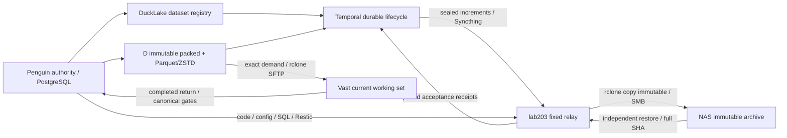

# DuckLake、Temporal 與不可變複寫部署

本輪目標 `ducklake-temporal-immutable-replication-20261005`。使用者於
2026-10-05 明確選擇 DuckLake、Temporal、rclone，取代前輪「僅保留候選」
決策。舊實測與驗收紀錄保留；本文件是新的部署計畫，完成證據另列。

## 從需求推導責任

不可再取得的來源、可重建的訓練中間資料、控制交易與離機恢復需要不同
生命週期。縮短總完成時間的主要方法是只搬新增物件、避免在 HDD 上重寫
歷史、讓遠端建立訓練視圖，以及讓已完成階段跨故障保留。

| 節點／技術 | 具體責任與禁止混用的邊界 |
| --- | --- |
| penguin | 唯一資料發布與版本 authority、控制 PostgreSQL、網站與下單；研究／儲存背景程序有 CPU／記憶體預算 |
| D HDD | 不可變主冷庫；既有 packed 原值及新 Parquet/ZSTD 分析物件；mutable catalog／工作佇列不放 HDD |
| DuckLake | PostgreSQL catalog 管快照、表與 dataset release 對應；檔案清單連回來源 manifest／SHA，不以新 catalog 掩蓋原值缺損 |
| Temporal | PostgreSQL persistence 與 visibility 管發布、複寫、驗收、等待及接手；活動重用既有 owner／canonical 操作 |
| lab203 | 單一 relay owner；接收封閉版本，rclone `copy --immutable` 複寫至 NAS，獨立讀回與逐檔驗證後回 ACK |
| NAS | 災難恢復 archive，保存不可變資料及相應 catalog 狀態；不執行訓練或掌握發布權 |
| Vast | 按固定版本取資料，在當次硬體上建立訓練視圖；完成產物回權威後才依既有 recovery／consumer gate 回收 |
| Restic | 程式碼、設定、SQL logical dump 等傳統加密備份；既有資料庫與資料備份在新 archive 獨立驗收前繼續服務 |

DuckLake catalog 的修改是 MVCC transaction；資料檔案名稱不可變，查詢
固定 snapshot。來源為 JSON／CSV／壓縮原值時保留其原格式，DuckLake 用
Parquet/ZSTD registry 管 dataset membership；不假造金融欄位或把全歷史
重編码當作採用 DuckLake 的前提。適合 SQL 的 Parquet 資料另外逐表接入，
保留 schema、日期、NULL／NaN、來源時間與完整列核對。

官方 adding-files 會將 Parquet 所有權交給 DuckLake，維護可能移除檔案，
因此不直接轉移 live source／packed recovery 物件的所有權。不啟用
snapshot expiration、DuckLake cleanup、NAS archive 刪除或 Restic prune。

## 不可變交易與 transport

版本身分包含 DuckLake snapshot、固定 catalog dump、來源 release 清單及
物件 SHA-256／bytes。所有 mutable heads 先捕捉為具名版本的固定 bytes；
不使用 rclone immutable 覆寫 current.json、PostgreSQL live files 或 Syncthing DB。
完整來源驗證、固定 manifest、READY 後才發布。接收端在同一 owner 下
copy，獨立讀回完整集合／SHA，成功才發該版本的 NAS ACK。

`rclone copy --immutable --checksum` 不刪目的地，但 backend 無共同 hash
時 checksum 可退回僅比較大小，故完整 SHA 是不可省略的 acceptance。
若目的地已存在相同長度而內容錯誤，拒絕並保留證據，不重寫同名檔案。
分階段恢復未完成 copy；只有 ACK 的 exact transport cache 可以回收。

保留已配對 Syncthing 作 lab203 的私有 ingress／回執通道，不啟用 SSH。
rclone 在 relay 將完整來源複寫到實際 NAS mount，並在已授權的 Vast
連線上實測不可變節點 replication。若需要取代 ingress 的底層網路協定，
必須先有接收端已安裝的可信 transport endpoint；不把本機 copy 宣稱成
全程直接 rclone 網路傳輸。一次性固定版本安裝包由 lab203 本機 Codex
安裝；之後無逐批人工通訊。封閉工具同步不等於遠端安裝已完成。

## 部署與驗收順序

1. 保存 Git、既有 runtime／owners、D mount、CPU／RAM／磁碟與遠端現況。
   從官方取得 pinned server／rclone binary、SHA 收據；用 Miniforge/Mamba
   獨立工程角色及 explicit lock，不修改 native GPU／交易環境。
2. penguin 現有 PostgreSQL 中新增隔離角色與 DuckLake、Temporal persistence、
   visibility databases，限制 loopback；不重啟或覆寫 control database。
   正式 Temporal server／worker 交 systemd，私有設定與程式版本分開鎖定。
3. DuckLake 登記現有合法 publication catalog 的 dataset releases，保留
   missing／abandoned history 狀態，不把未知版本列成可用。測量首次建置、
   增量與 no-op；用真實資料測量 Parquet/ZSTD 與固定版本查詢／恢復。
4. Temporal 啟動實際持久 lifecycle：觀測／註冊、封閉複寫、等待 NAS
   acceptance、狀態發布；活動有固定 handler、receipt fence 與 owner，
   沒有 arbitrary shell／broker order／未選定 GPU 訓練。
5. 同步 lab203 固定安裝包，沿用其已驗收 NAS mount、runtime、接收／回執
   身分，新增 bounded archive owner；Restic 舊 owner 不被替換。
   NAS archive 與原 Restic repository 是不同目錄。
6. Vast 使用實際 cgroup／CPU topology／RAM／disk，測量小型真實 immutable
   replication 全流程；保留來源與既有訓練，按需資料 gate 不被 bypass。
7. 以真實資料驗證重送 no-op、錯誤同名拒絕、來源變動拒絕、服務／worker
   中斷接手、Temporal server restart／history replay、固定 catalog 與
   資料副本獨立還原；測試 NAS unavailable 不落到本機替代目錄。

## 完成判準

每項保存觀測時間、固定 identities、完整命令退出碼與 scope。服務 active
只證明程序活動，選定架構完成還需要有效 dataset version、實际 lifecycle
history、paired relay runtime／owner receipt、NAS archive 獨立恢復 ACK、
Vast replication 與重啟恢復證據。全歷史備份覆蓋另用最新分母報告。
未收到 relay 機器證據時維持待驗，不宣稱所有節點已部署。

## 技術依據

- [DuckLake snapshots](https://ducklake.select/docs/stable/duckdb/usage/snapshots)
- [DuckLake adding files](https://ducklake.select/docs/stable/duckdb/metadata/adding_files)
- [DuckLake backup/recovery](https://ducklake.select/docs/stable/duckdb/guides/backups_and_recovery)
- [Temporal self-hosted guide](https://docs.temporal.io/self-hosted-guide)
- [Temporal Python Continue-as-New](https://docs.temporal.io/develop/python/workflows/continue-as-new)
- [rclone copy](https://rclone.org/commands/rclone_copy/)

## 已部署的流程



正式工程環境由 Miniforge/Mamba 建立，Python 3.12.14、DuckDB 1.5.6、
Arrow 25、psycopg 3.3.4、Temporal SDK 1.34；explicit lock、distribution receipt
與 runtime 身分分開保存。環境建置實測 19.869 秒，不修改原交易／CUDA 環境。
固定 Temporal server 1.32.0、rclone 1.75.1，官方下載及二進位 SHA 已核對。
原 PostgreSQL 18 main 沒有因本輪安裝／故障驗收重啟。

新增三個獨立 databases：`stockagent_ducklake`、`stockagent_temporal`、
`stockagent_temporal_visibility`。server 用正式 PostgreSQL persistence/visibility，
不使用 start-dev；服務只綁 loopback。私有設定留在 `/etc/stockagent`，不入 Git／
同步工具套件。Role runtime 及 extension lock 由 wrapper 每次核對。

| 正式 owner | 功能／實際啟用方式 |
| --- | --- |
| `stockagent-temporal.service` | 持久 server，systemd enabled／active |
| `stockagent-storage-lifecycle.service` | 兩條實際 RUNNING workflows；catalog 註冊／封閉／NAS 等待，以及 raw CAS 增量 |
| `stockagent-lifecycle-control-backup.timer` | 每 15 分鐘一致性備份上述三庫，沿原 Restic relay；等待前批 NAS ACK 時不再新增一批 |
| `stockagent-lake-transport-gc.timer` | 單次一批已驗收暫存，退出後 30 秒續巡；不阻塞下一批 raw publication |
| `stockagent-packed-transport.timer` | 原 15 秒 owner 已接 rclone SFTP，僅傳 Vast 固定需求；index 仍由 Syncthing 管 |
| `lab203-lake-relay.service/timer` | lab203 本機一次性安裝固定 v1；同一 NAS mount／owner lock，NAS 獨立驗收後反向 ACK |
| `lab203-backup.service/timer` | 原傳統加密備份／還原 owner 保留；與新 archive 使用不同 NAS 目錄 |

DuckLake registry contract 2 包含 `dataset_releases`、`source_objects`、
`catalog_captures`、`source_metadata`。最後一張保存原 UTF-8 manifest／固定
heads bytes，SHA／bytes 逐一核對，讓災難還原能重建 canonical packed namespace。
所有 registry data 使用 Parquet/ZSTD，data inlining 為 0。這是 dataset version
與 provenance 的正式 registry；全金融來源逐表 SQL／Parquet 遷移尚非本輪完成範圍。

原 D NTFS／8 KiB 9p guard 保留。新 lake 位於
`/srv/stockagent-d-volume/stockagent-immutable-lake`，live catalog 放 SSD PG；
沒有格式化、ext4/ZFS 遷移或重壓全歷史。原 packed ZIP／blob 的 bytes 與 manifest
不被重寫；每批增量只複製新增 CAS，傳輸 layout 扁平化減少 HDD 目錄操作。

## 實測驗收與修正

所有證據位於 `artifacts/operations/ducklake-temporal-replication-20261005/`。
保留失敗收據，不把重測成功改寫成第一次即成功。

| 驗收 | 實測結果與範圍 |
| --- | --- |
| NAS immutable catalog／data | lab203 機器 ACK：完整 copy／精確集合／full SHA／獨立 NAS restore，並完成私有 PG logical restore、native DuckLake snapshot／所有表 rows 核對 |
| 固定 registry contract 2 | snapshot 10，delivery `cd2360619e3ac3a2cc54d9d03db71ae9db73fcc09f28708034f0854d725ab04a`；四表 NAS native 驗收通過 |
| 三庫傳統備份與 logical restore | 固定 NAS snapshot `37949bb0c291b2c1ab6d36cb4f99577c5a9624042aa3c806896ee2ce02b2a7f8` 的 bytes 已獨立還原核 SHA；同 bytes 在私有 socket-only PG 還原三庫，核對 same-MVCC 全表 columns／rows；原 PG 不變 |
| packed canonical 重建 | 從獨立還原的 registry 原 manifest，加兩批 NAS 已還原核 SHA 的 hash-identical 物件副本，重建固定 release；3 CAS 共 1,420 bytes、2 packs 共 1,031 bytes，materialized 原值／portable fingerprint 通過；單次重建 3.64 秒 |
| Vast 真正缺件的按需流程 | 遠端原先缺 2 payloads，正式 rclone owner 複寫 1,031 bytes，canonical use／SHA／解封／lease 全程 19.15 秒、退出 0；沒有啟動 GPU／下單或刪既有訓練 |
| 實際 SFTP workers 1／2／4 | 9 檔 1,731,908 bytes，同 workload 交錯兩次；平均 4.155／2.790／2.690 秒。2 與 4 差距小，選 2 以限制共享 HDD／背景負載；不是大資料／GPU 完整 workflow 的最快證明 |
| 已存在的 Vast 工作集 | 107 objects／6,350,541,864 bytes 經遠端全 SHA，後續受簽章／時間限制的 no-op 約 1.01–1.19 秒；工程新增檔另有真實複寫收據 |
| Temporal server SIGKILL | 修正依賴後 6.61 秒恢復兩條 workflow 查詢，run IDs／history prefix 不變，原 PG PID 不變 |
| Worker SIGKILL | Python 直接受 systemd 監督後，67.28 秒內恢復查詢並證明中斷活動由新 worker 重試，run IDs／history prefix 保留 |
| 不可變／中斷／回收 semantic tests | 真 rclone 同名衝突／重送／未完成 READY；短寫、未登錄批次、未知／來源變動、精確回收、原值重建與 stale／wrong peer／code boot gate 均有 focused tests |

packed 收據是「實際 NAS file restore + hash-identical copies 的獨立 canonical
reconstruction」組合證明，Penguin 工具未直接登入 NAS。不是任意版本或全歷史
均重建完成。三庫的 file/NAS restore 與 SQL logical restore 也分開列出；未將
備份檔驗證說成啟動完整災難恢復主機或 production Temporal from backup。

實測找出的三個持久性瓶頸已修正：

1. 原長活動沒有 heartbeat timeout，worker 死亡可能等兩小時。現行每 10 秒
   heartbeat、60 秒 timeout；既存活動透過 server UpdateActivityOptions 更新，
   不重設 workflow／刪歷史。
2. 原 server Requires/After 依賴會連帶停止 worker；第一次 server 驗收超過
   180 秒。改為 Wants／自動 reconnect。Shell 主程序中止也曾使 worker 超時，
   已改 `exec_fintech_python`，直接監督 Python；失敗證據保留。
3. HDD 暫存回收原位於 raw 增量提交路徑，會阻塞 NAS 覆蓋落帳。現行 ACK
   先持久化，回收交獨立有界 timer、每批 lock；copy／seal／rename／enroll 的
   持久 intent 支援同一批中斷接手，保留未知檔案而不重複生成波次。

兩條 workflow 每 60 個正常巡檢週期 continue-as-new，保留 workflow ID 並建立
同鏈的新 run。catalog 長期等 NAS 時另以 server 建議／5,000 history events
續接，帶入固定 pending delivery 和上一 snapshot，不能改等 moving latest。
新碼已重播當前實際 649／423 events 的持久歷史，兩條均通過；NAS 長停續接
及固定身分接手另有兩個角色環境測試。續接是受控 history checkpoint，與
中止後同 run history prefix 的 crash 驗收不同。

最終 focused storage regression 182 tests 通過，角色 workflow continuation
另 2 tests 通過；skill frontmatter／UI／references 及連結檢查通過。Vast 工程
probe 的 payload 與短 lease materialization 已由 canonical GC 自動回收，
未手動刪既有遠端資料。

整合收據為
[`production-acceptance.json`](../artifacts/operations/ducklake-temporal-replication-20261005/production-acceptance.json)，
觀測於 2026-10-05T04:45:37Z：四個新控制 owner 的排程／程序、兩條持久
workflow、已載入程式身分、paired NAS guards、原 Vast transport 與整合
boot readiness 均通過；狀態為 `selected_services_operational_backfill_continues`。
這筆部署驗收與全歷史備份完成分開。

後續 raw 批次 `c14b3ab0f24e48021e8c132b22399a1e9853b0df2f7df83d04ce27015c36b1f1`
亦自動通過 NAS 驗收：866 個原值物件共 1,072,255,307 bytes，含 manifest／READY
共 868 檔、1,072,584,377 bytes；copy、獨立 NAS restore、精確集合及全檔 SHA
通過，四個命令退出碼皆 0。lab203 這次完整 NAS 流程為 86.28 秒，不含 penguin
在 HDD 上準備波次與 ingress 網路等待時間。來源 owner 已持久登錄 ACK；
[`latest-full-raw-wave-nas-acceptance.json`](../artifacts/operations/ducklake-temporal-replication-20261005/latest-full-raw-wave-nas-acceptance.json)
保存固定批次及當次機器回執。準備下一批時的公開 status 可暫留上一完成巡檢的
覆蓋數值，以固定 ledger／ACK 判定該批，不把 status 更新延遲當成檔案未驗收。

## 日常操作

```bash
# Penguin：唯讀查真正 workflow/run/snapshot 狀態
bash scripts/run_lakehouse_control.sh status

# 分列 archive 與舊 Restic 覆蓋，核對 index／scheduler／收據
bash scripts/run_data_cache.sh automation-status --human --live

# 完整當前恢復 gate；這是當前 readiness，不會重啟主機
bash scripts/run_boot_recovery_audit.sh

# Vast：本期工作固定版本，遠端 canonical use 自動等待 exact payload
bash scripts/run_data_cache.sh use DATASET --snapshot-id EXACT_RELEASE_ID --ttl-days 7
```

來源／catalog 狀態在 `/var/lib/stockagent/lakehouse-control`，反向 archive 收據在
`/srv/stockagent-backup-receipts-lab203/lakehouse`。新的傳統 SQL status 保留上一批
NAS acceptance；本批等待不抹除已驗收證據。`active`／exit 75／index 100% 都不代表
file 或 semantic acceptance。背景服務持續執行，不需常駐 Codex／人工逐批轉貼。

固定版本獨立恢復工具：`scripts/verify_lakehouse_recovery.py`（單一 catalog/data）、
`scripts/verify_lakehouse_packed_recovery.py`（NAS-attested exact source reconstruction）、
`scripts/verify_temporal_recovery.py`（僅新控制 server/worker 中止）。恢復輸出需新的
receipt path；不要覆寫舊驗收或還原進線上 PG。`source_metadata` 和所有必要
CAS／inventory 都需固定具名版本，不能只拿目前 heads 或 latest。

操作 skill 已更新於 `.agents/skills/stockagent-storage-operations/`。其他 agent
先核對現在的 role/config/receipts，再沿唯一 owner；skill 不取代 actual receipts。

## 覆蓋與尚未宣稱的範圍

2026-10-06 已將來源進度改為 Restic／immutable archive 的相對路徑與 SHA 精確
聯集，區分機器獨立還原和轉述 pilot 證據；raw 波次採有界平行在途與未覆蓋
物件優先，原 Restic 接續保存 manifest/head metadata。固定清冊、Windows
原生 I/O 實測及本輪全量驗收狀態見
[補傳報告](nas_sync_catchup_2026-10-06.md)。這不會把下面的歷史驗收自動擴張為
全歷史完成。

2026-10-05T04:21:55Z 原 Restic source status：710,128,363,417／768,843,372,660
bytes，無 pending batches，`all_history_backup_verified: false`。新 archive 是
另一份獨立補齊，分母亦可能隨當前 canonical publication 成長；最終最新數值保存
於同目標的 `production-acceptance.json`，使用上述唯讀命令查當前值，不用這筆
時間點當固定分母。兩套資料有重疊，不能相加為去重後全歷史完成率。

USB 金鑰異機保管已由使用者確認，不重問；Windows 登出驗收已取消，未宣稱
通過。本輪實際做 process crash／history recovery，未重啟實體 Windows／WSL
主機。NAS prune／archive deletion 維持關閉，Vast 使用中的訓練與來源照原 gate
保留；全歷史補齊及實際磁碟格式遷移是獨立階段。
