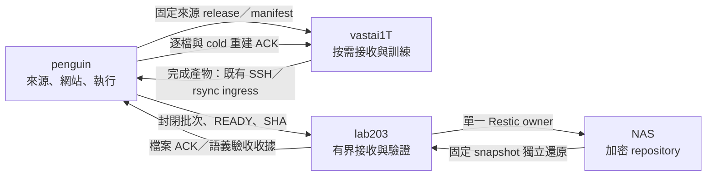

# 四節點儲存與訓練產物回傳架構

2026-10-05 的實際角色清冊、完整壓縮／還原測量、共用鎖與自動重試修正見
[續作驗收](four_node_storage_optimization_2026-10-05.md)。下方容量與服務狀態保留
原觀察時間，不代表最新全歷史備份或全量清理已完成。

## 從需要保存的事實推導

penguin 是來源、資料服務與執行的權威節點。lab203 是有界的備份中繼，NAS
保存加密備份，vastai1T 是可被重建、可能隨租用實例消失的運算節點。
永久性來自資料身分、不同故障域的完整恢復與金鑰保管；不來自檔案同步成功
或四台電腦使用同一種檔案系統。

不可重抓的歷史行情、時間／單位／授權／修訂證據與收集狀態留在 penguin。
下載器、資料庫、盤中 ledger 與網站工作目錄使用原生 Linux 熱路徑。發布
固定 Parquet／來源收據及 packed CAS；Vast 接收精確 release，按 Git、設定、
ABI 與環境生成 panel、tensor、split 和編譯 cache，訓練產物完成後回傳。
返回 penguin 的產物必須完整通過 lifecycle、逐檔驗證和 cold 解碼重建，才
可回收 Vast 的那份已完成來源。NAS 備份／還原與模型部署另外驗收。



## 現有硬體上的檔案系統選擇

| 節點／用途 | 當下選擇 | 證據與限制 |
| --- | --- | --- |
| penguin 程式、DB、收集／網站／執行熱資料、暫存 | WSL 原生 ext4 | 實際 `/dev/sdd`，保留 journal／fsync。Windows C 是 NTFS，ext4 位於 VHDX；兩層容量都需檢查 |
| penguin packed 權威冷庫與封閉備份傳輸 | 現有 D NTFS，經受保護的 9p／DrvFs 掛載 | D 約 4 TB、marker UUID 固定。保留現有 8 KiB 9p 設定；只有大檔與不可變 metadata，不把 DB／小檔 cache 移入 |
| lab203 ingress、狀態及驗收暫存 | 現有 WSL ext4 | 使用者部署紀錄與當前語義 ACK；本機沒有 SSH，這次未直接重讀其 mount table |
| lab203 → NAS | SMB 3.1.1 encrypted CIFS，單一協調 owner 下受限並行備份／還原 | 實際 NAS 固定 snapshot 還原已通；並行與 repository check barrier 見[並行管線](lab203_parallel_backup_2026-10-04.md)；CIFS 是存取協定，不能用它判定 NAS 底層 filesystem |
| NAS | 沿用現有 QNAP pool／share | 尚未獨立取得型號、QTS／QuTS hero、RAID、snapshot 管理權限，不宣稱它已使用 ZFS |
| Vast 當下 | 平台提供的本機 overlay 工作磁碟 | 2026-10-04 實查 `workspace_is_volume=false`。容器內不能選擇或重格式化宿主機的 ext4／XFS；保持 index-only、原生本機工作資料與產物回傳 |

Microsoft 建議 Linux 工作留在 WSL filesystem，避免跨 Windows filesystem 的
翻譯成本；與這次的路徑實測一致，但不能把建議當成所有硬體上的排名。
[WSL filesystem guidance](https://learn.microsoft.com/en-us/windows/wsl/filesystems)

新的 Linux 本機磁碟以 ext4 作此專案預設候選；大型本機 SSD、並行 mmap／大檔
工作可比較 XFS，須先在同一磁碟測完整 prepare→train→checkpoint→return，不能
用這次三台不同磁碟的數字宣稱 ext4 勝過 XFS。現有 overlay 路徑足以先使用；
若未來平台已提供獨立本機 volume／bind mount，優先測量它與容器 writable layer。
Docker 文件說明 storage driver 的 copy-up 成本及 volume 繞過該層的特性；這次
新建的測試檔沒有測到 image lower-layer copy-up。
[Docker OverlayFS](https://docs.docker.com/engine/storage/drivers/overlayfs-driver/)

NAS 或未來專用冷資料機需要 checksum、snapshot、scrub 和磁碟冗餘時，評估
ZFS／QuTS hero。ZFS 無冗餘時能偵測而不能修復損壞。既有 SHA-CAS／Restic
已提供應用層去重，ZFS dedup 預設保持關閉；它有明顯的 metadata／RAM 成本。
[OpenZFS scrub](https://openzfs.github.io/openzfs-docs/Basic%20Concepts/Operations/Scrub%20and%20Resilver.html)、
[OpenZFS dedup](https://openzfs.github.io/openzfs-docs/Basic%20Concepts/Data%20Storage/Deduplication.html)

QTS 使用 ext4、QuTS hero 使用 ZFS；轉換不是無損套件升級，QNAP 說明跨系統
磁碟初始化會要求格式化。現有共享 NAS 不在本輪格式化範圍。
[QNAP migration](https://www.qnap.com/en/how-to/faq/article/what-will-i-see-if-i-migrate-my-disks-from-quts-hero-to-qts)

Btrfs 可作需要 Linux subvolume／snapshot 的候選，但本輪沒有同盤測試或平台
遷移條件。對 DB 為效能關閉 CoW 會同時失去該檔案的資料 checksum，不能把
這種配置宣稱為同時取得全部保護。
[Btrfs scrub](https://btrfs.readthedocs.io/en/latest/btrfs-scrub.html)

## 實測與效益的界線

固定測試包含寫入、每檔 fsync、rename 成封閉檔案、列舉、完整讀回與 SHA-256，
只使用新建 scratch，成功後移除。三次交錯測試，沒有清 OS cache，沒有修改
來源、journal、mount options 或 GPU 工作。第二輪 v2 兩組各 8 MiB：小檔
128 × 64 KiB，packed 2 × 4 MiB；使用隨機 block，三次交錯量測。

| 實際路徑 | 小檔完整流程中位數 | 大檔完整流程中位數 |
| --- | ---: | ---: |
| penguin `/var/lib` ext4 | 0.637248 s | 0.027944 s |
| penguin D DrvFs | 8.210649 s | 0.646186 s |
| Vast `/var/lib` overlay | 0.315668 s | 0.098273 s |

同一路徑、相同總 bytes 的小檔→大檔流程，penguin ext4 約 22.80 倍、D 約
12.71 倍。這證明這組包含逐檔 fsync 的布局效益，不等於實際 Parquet、checkpoint
或所有 collectors 都會同幅改善，也沒有模擬斷電。C 是 ZHITAI TiPlus7100s 4 TB
NVMe SSD，D 是 ST4000NE001-2MA101 4 TB SATA HDD，這是硬體與掛載路徑的
共同結果，不能當作 ext4／NTFS 算法排名。Vast
數字只證明這次本機工作路徑可用，不能證明其儲存耐久或下一台租用機同樣快。
完整原始收據位於 `artifacts/operations/four-node-storage-20261004/` 的
`penguin-filesystem-equal-payload.json`、`vast-filesystem-equal-payload.json`。
前一輪 v1 的大檔組是 16 MiB，保留原始收據，不混作相同總量比較。

## 已實作的自動產物回傳

沿用 `stockagent-remote-cold-artifact-ingress.service`／timer／owner lock，不另建
一套 training scheduler。`configs/data_sync/training_return.json` 只授權
`markets`／`ablations` 中通過 canonical lifecycle 的完整 runs。每輪最多處理
一個；10 分鐘穩定窗口、每 run 32 GiB／100,000 files 上限、penguin 真實餘量
64 GiB 加兩倍 run 工作空間；不同硬體上的調整要重新量測。

例行 discovery 到 `run_manifest.json`／`progress.json` 的 run 邊界就停止向內
遍歷，再驗所需 checkpoint、backtest containers、curves 和 plots。無效 label
不能發布，執行中或服務引用的來源不能回收。只對當次選中 run 做全內容工作，
传輸後只重驗選中的精確 root，保留完整 lifecycle／metadata／process 驗證，不
重新掃描其他 runs。已有獨立返回證明與配對 cold convergence 才能產生
`durable_completed_training_return_v2`。
輪詢的 last-attempt journal 讓失敗或無法清理的舊 run 不會永遠堵住後續有效 run。
未確認的 publication wave 由 `training-return-waiting-peer.json` 固定 snapshot／SHA，
先收尾這一批再發布下一個。來源已被另一個授權 owner 回收或暫時不適用時，
只確認該 cold wave，記錄沒有執行來源刪除。發布使用既有 durable scan intent
及 scan retry timer，來源交易不需要等待每個 Syncthing HTTP scan request。

回傳使用既有 SSH／rsync，只把一個精確 root 收至 ext4 私有 staging；不把
mutable artifact tree 放入 Syncthing。接收後保留每個 checkpoint、plot、curve、
ZIP 與 log，逐檔驗證、按 canonical full-run pack 發布到 penguin D。返回 ACK
要求每個 packed member 的獨立解碼 SHA、精確集合與 mode，再透過 SSH 固定
程式回到 Vast：fresh dry run、相同 fingerprint、來源全 SHA／inode／ctime、
process／service／link／mount gate、私有 intent journal、原子 quarantine、再核對後
逐檔 unlink。失敗／未知檔案保留，不能以同步 100% 或相同大小代替成功。

實際舊 run 有 2～165 個 hardlink names，直接以邏輯大小計算回收會高估。
v2 只 unlink 返回 run 的精確名稱，保留所有外部 alias；用 inode 查外部 FD／mmap
引用，捕捉未知 link count／ctime 改變；同一 inode 的 controller-owned unlink
更新納入逐檔核對。配置區塊計量重用 `artifact_retirement._reclaimable_file_bytes`，
只有最後一個 name 被移除才計入，不把外部共享資料宣稱為釋放。此政策不更改
其他 legacy、hot mirror 或 materialized cache 的回收契約。

回收僅限這份完整返回的 **Vast 訓練產物來源**，不含 downloader 原值、input
release、未完成 run、未知 derived cache、Git、NAS 或 penguin 的 cold 原件。
可重建訓練輸入继续使用現有 edge cache 的 exact release、READY、pin、lease
和 process／durable-peer GC。此次沒有把七日通用租約改成零，也沒有按根目錄
直接刪所有資料。

來源完成 cold 發布後，現有備份 stream 會在下一次 cold catalog reconcile
納入新 objects／metadata，經 lab203 驗證與 NAS fixed restore ACK。這是後續離機
備份；返回 ACK 只聲明 penguin 的 exact cold 恢復，不能冒充 NAS 已完成。
模型上線仍由獨立的 checkpoint／部署／執行驗收控制，不能因回傳而自動下單。

## 部署與檢查

```bash
source scripts/runtime_env.sh
run_fintech_python scripts/install_training_return.py \
  --evidence artifacts/operations/four-node-storage-20261004/installation
systemctl start stockagent-remote-cold-artifact-ingress.service
```

安裝器僅在既有 private env 加入已驗證 policy，保存可回復的 private 原件，
加上 1 GiB MemoryHigh／2 GiB MemoryMax，保留原 service／timer 檔。狀態在
`/var/lib/stockagent-cold-artifacts/remote-ingress-status.json`；source recovery ACK
與 exact retirement 收據在同目錄的 `training-return/`。Vast 失敗 quarantine
與清理 intent 保留在 `/var/lib/stockagent-training-return/`。

penguin 實際 WSL 發行版是 `Ubuntu-26.04`。安裝器把已核對 VHDX 的發行版
身分存入既有 private environment，讓 systemd 非互動執行也能驗真實 Windows
backing-drive 餘量；沒有身分時拒絕猜測 `Ubuntu` 或採用虛擬容量。

## 2026-10-04 實際驗收與進行中的工作

- 完整來源返回、原始 mode／SHA、共享外部名稱、同 inode 多名稱、外部 FD、
  無 FD 的 mmap、來源異動、consumer parser、cold／packed／scan／cache：
  `training-return-final-regression.xml` 203 項通過，包含 pending wave 路由驗證。
- 正式既有 ingress 首次真實 run：`markets/tw_day_trade_daily_no_default_v1`，
  495 files／2,886,694,477 logical bytes，cold objects 約 1.72 GB。
  發布、來源對比及全部 495 檔獨立 cold 解碼通過；首次同步通知流程 474.849 s，
  這個時間包含被共享 hardlink gate 擋下的 v1 retirement，不能稱作成功回收耗時。
  v2 重新獨立解碼全部 495 檔後，真實 Vast dry run 無 blocker；考慮外部
  hardlink 後預計可回收 1,745,305,600 allocated bytes。12:53 時仍在等待 owner；
  13:24 已由同一 timer／owner 實際回收，來源 ACK 與 Vast `retired` journal
  逐欄吻合、原目錄不存在。另一次 485 檔回傳也已實際回收 1,630,461,952
  allocated bytes，493 檔回傳回收 1,210,613,760 allocated bytes；共享外部名稱保留。
  加上已獨立驗收的歷史 24 檔，本輪共回收 4,606,332,928 allocated bytes。詳見
  [同步與回收加速驗收](vast_sync_cleanup_acceleration_2026-10-04.md)。
- lab203 v7 queue 已現場安裝：固定 plan
  `46a06550de246c7a9cf7aad97251c524d1df2faf0b470891e03868e522b25a89` 的 NAS
  CFTC／TAIFEX packed 原值重建及 PostgreSQL logical restore 通過；50 tables、
  60 rows，完整 52.332 s，正式 DB 未修改。接受身分
  `6da284a7798000fecf9a8c7ce470cd1ea1b7f7f6c58f55f0e5bab28e0860565f`。
- NAS file ACK 覆蓋先從約 47.51 GB 增至 53.63 GB，14:08 的完整 cycle 收據
  為 69.25 GB／687.09 GB 可備份資料。持續新增的 cold 產物已納入 catalog。
  這是該 cycle 的觀察時間；全歷史尚未完成，collector
  未發布原值不在這個覆蓋聲明內。
  source stream、lab timer 與 data-only recovery queue 繼續自動處理。
- 12:53 現場核對：ingress／receipts Syncthing 都 idle、待傳及錯誤為 0，
  lab203／vastai1T 連線有效；packed 仍 scanning，沒有把零待傳當作已收斂。
  penguin 三個正式 timer enabled／active；Vast 保留 index-only 與既有
  `/etc/cron.d/stockagent-data-cache-gc` 五分鐘 GC，cron 程序存在。只聲明排程
  與本次現場狀態，不以排程存在替代每個 cache 的回收成功證明。
  最終脫敏收據：`artifacts/operations/four-node-storage-20261004/final-acceptance.json`。
- 12:54 來源 timer 曾在另一個維護工作期間停止，已核對 12:57 恢復
  enabled／active，既有正式 service 接手同一 owner。來源忙碌時拒絕額外的
  resume 操作，沒有插入第二個 writer；見 `source-timer-resumed.json`。每次
  最終觀察另保存 `acceptance-<UTC>.json`，task milestone 綁定該固定收據。
- 15:24 補上兩個保留歷史 cohort 的五分鐘重試 timer；只讀 condition 在
  既有 owner 忙碌時跳過。原清冊、共享 ingress 及來源回收 gate 均沿用，沒有
  第二個 cohort writer。包含冷編碼／接手的新共用驗證為 255 passed。
  Vast 與 lab203 連線有效；新發現的備份目錄掃描 ENOMEM 經重試後，ingress
  已回到 idle、need／errors 均為零。23.11 GB 失敗封存保留的暫存已全檔驗證，
  等待同一 owner 重試；8.83 GB 分區仍在 cold 發布，均未計入已回收空間。

進行中的歷史 archive return 與新 completed return 共用現有 ingress owner，
先前者持鎖時 timer 保留任務，下一次取得 owner 後接手；沒有並行刪同一來源。
歷史清冊的 owner 結束後，由 `stockagent-legacy-return@main.timer` 與
`@partitions.timer` 自動接手未完成的穩定候選；未知、使用中及其他受保護項目
仍須對應證明，不以重試次數解除保護。
Vast `stockagent/config.py` 最初有 merge markers，重查已可解析；每次 retirement
仍重跑完整 consumer gate，舊錯誤記錄不替代當下 proof。

## 後續遷移次序

1. 持續把目前已允許發布的冷資料補齊 NAS 備份，逐批保留 fixed restore ACK。
2. 已實際通過三個 training return→penguin cold full reconstruction→Vast exact
   source cleanup；繼續由既有 timer 驗收後續 run，歷史兩個 cohort 依可回收
   空間優先處理。尚未完成的候選不計入實際回收量。
3. 有新增空磁碟、已存在的 volume 或完整異機恢復時，才比較原生 ext4／XFS
   工作磁碟與目前路徑。D cold 遷移需同步更新 physical marker／guard、服務
   dependencies、Syncthing scan、全內容恢復與回滾，不以 mount alias 偷換權威。
4. NAS 管理端取得 pool／filesystem／RAID／snapshot 資訊後，再按可修復性與
   長期費用决定 ZFS 是否有額外收益。現在維持已驗收的 repository。
5. 長時間 GPU jobs 的 checkpoint recovery point 應獨立於完整 run return：
   只備份 canonical writer 已封閉的 checkpoint、loss/curve、設定、ABI 與環境，
   以 checkpoint loader 做實際 resume 驗收。這一版只自動回傳完成 runs，Vast
   完成前的程序進度仍受 ephemeral 磁碟故障影響。
6. 量測 lab 每批完整 Restic repository read-data 隨總量增加的成本。維持每批
   fixed snapshot 獨立全檔 restore／SHA，整庫 full scrub 應按受驗證的時間策略
   排程。切換需一起更新 lab 固定 worker／runtime receipt 與來源 ACK contract，
   現有資料請求不會自動部署新程式或聲稱此變更已完成。

四個異質節點不需要一個 Ceph／Gluster 共享 namespace。需要的是單一寫入權威、
版本化不可變資料、明確工作 owner、有界流量與機器可讀 ACK。維持現有
Parquet／Arrow／Polars／DuckDB 分工；PostgreSQL 控制跨節點 metadata。只有
同一分析表真正需要多機 transaction 時再評估 DuckLake；Temporal 留給需要
跨機多階段 durable workflow 的具體工作鏈，這次沒有接管正式交易程序。
