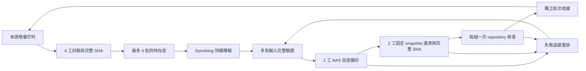

# penguin → lab203 → NAS 並行管線（2026-10-04）

使用者要求整條鏈可同時處理不同批次，失敗重排，不等待逐批人工交接。
來源單批在途限制改為四批／32 GiB；封裝、Syncthing 和 NAS 的不同批次可重疊。
同一批的資料身分仍有先後關係：封閉後才能發布，固定 snapshot 完整還原驗證後才能接受。

**目前部署：固定 v10 已由 penguin 回傳通道獨立認可。** 來源維持四工封裝／
四工驗證、四批／32 GiB 在途；NAS 現場量測後採用四批、兩工 backup、兩工
restore、四工 verify。日常批次與重試持續自動進行，不需再安裝或逐批轉貼。
全歷史覆蓋仍隨逐批 NAS ACK 推進。

## v10 現場驗收與選定配置

2026-10-04T06:24:38.408243+00:00，penguin 驗證收到的 `pipeline-status.json`：
配對裝置／repository 正確，固定部署 manifest 身分為
`1b8b909edf54bfdcceb4dcb04887da423dc80b76af5e40e11acbf33493cd4ea3`，
`installed_package_version=available_package_version=v10`、`upgrade_pending=false`，
runtime lock 與 single owner 門檻通過。來源另重跑凍結套件完整 SHA／精確集合，
envelope 與原始 manifest SHA 均吻合先前 publication receipt。

lab203 使用者轉交的實際 NAS 完整流程量測如下。私有 benchmark 證據仍在 lab203，
本次 penguin 直接核對的是固定新版部署收據及實際載入的並行配置。

| jobs／backup／restore | 完整流程中位數（秒） | 選定 |
| --- | ---: | --- |
| 1／1／1 | 10.708341 | 基準 |
| 2／1／1 | 8.160401 | |
| 4／2／2 | 6.624795 | 是 |
| 4／4／4 | 8.362590 | |

八個全新 NAS 實驗 repository、每次四個真實來源片段，共 32 個固定 snapshot 的
backup、獨立 restore、來源完整 SHA、check 及 ACK 均回報退出 0。樣本
47,728,981 bytes；初始化不納入 recurring cycle 中位數，105.528161 秒總計時
仍含初始化。未清除 OS 快取，實驗 repository／私有證據保留。
選定配置在此組樣本比單工約快 1.62 倍、時間減少 38.13%；不是全鏈或全歷史倍率。

同一 `lab203-backup.service`／timer 完成後 15 秒接續；沿用 v8 journal／scratch、
原 owner、v7 Mamba 角色與語意還原 post-hook。原 worker／設定保留，重試
30／120／600 秒；不完整候選排除修正已在固定新 driver 啟用。
每週 `check --read-data` 保留為 lab203 現場回報，本輪沒有新增正式 repository
故障注入，也不把先前來源工程測試改稱這次 NAS 故障驗收。

來源端收據：`lab203-v10-deployment-source-acceptance-20261004.json`；
即時來源／傳輸／覆蓋現場紀錄：`parallel-pipeline-v10-activated-20261004.json`，
皆在 `artifacts/operations/two-node-lab-nas-backup-20261003/`。

## 控制與資料流



來源與接收端各自保留一個控制 owner，控制器使用受限 worker pool。
不啟動第二套互相競爭的服務，也不關閉 Restic 鎖。
`restic check` 使用獨占 repository 鎖，因此在該組 backup／restore 結束後執行一次。
這是實際工具限制：[Restic locking](https://restic.readthedocs.io/en/stable/100_references.html)、
[Restic 0.19.1 check implementation](https://github.com/restic/restic/blob/v0.19.1/cmd/restic/cmd_check.go)。
輸入完整 SHA、固定完整 snapshot、Restic `restore --verify`、還原檔案完整 SHA、精確集合及收據門檻均保留。

來源在下一批封裝時掃描上一批，並在每個 wave 之間接收已到達的 NAS 收據。
不變的控制套件另有受限發布鎖，可在長資料 cycle 執行期間送達；它最多 1 MiB，
在同步目錄外完整封裝與核 SHA，再由已核對的同一實體 mount 原子發布。
這個發布器不修改來源 ledger、還原任務或回收狀態，資料控制 owner 仍只有一個。
正常未收齊的 Syncthing 批次只等候；內容損壞或 NAS 失敗各自退避重排，其他有效批次繼續。
已寫入的完整 snapshot 及已驗證的還原暫存可以接手重試，但會重新完整驗證。
成功後只清理該 job 的精確、已驗證且無程序引用的還原暫存；不刪 ingress、NAS snapshot 或原始資料。

## 已量測的來源改善

同一組 16 個真實檔案、88,671,192 bytes，執行順序 1／2／4／4／2／1 工。
每次包含來源 SHA、複製、fsync、目標完整 SHA、READY，以及額外獨立讀回驗證。
單工中位數 19.470 秒、兩工 9.015 秒、四工 6.660 秒；四工約快 2.92 倍。
每次封閉 envelope 身分完全一致。沒有清除 OS 磁碟快取，正式同步工作也可能競爭磁碟。
結果僅代表該組來源封裝與讀回，不代表網路或 NAS 的倍率。
證據：`artifacts/operations/two-node-lab-nas-backup-20261003/pipeline-export-measured-20261004.json`。
較大一組四個檔案、894,988,189 bytes，也完成同樣 1／2／4／4／2／1 工完整流程。
單工中位數 148.365 秒、兩工 83.043 秒、四工 63.056 秒；四工約快 2.35 倍，
每次封閉身分完全一致。這仍是來源階段的倍率；單一大檔案沒有因檔案 worker pool
而拆成多工，並行改善取決於批次的檔案布局。
證據另存 `pipeline-export-large-measured-20261004.json`。

## v10 安裝機制與恢復參考（已完成）

v7 的固定程式不能從資料佇列自行替換服務程式；資料同步不等於服務升級。
2026-10-04T05:40:26.375745+00:00，來源收到配對通道的新 `pipeline-status.json`，
已核對固定 v8 manifest 身分、runtime lock 與同一 owner；實際配置為四批／四個
backup worker／四個 restore worker／四個 verify worker，接收器已啟用。
當輪 jobs 為空，因此這份狀態不宣稱四個真實 NAS 工作當時正在重疊，也沒有 NAS 倍率。
v10 已完成本機一次性安裝，後續批次、重排、NAS 驗證與收據仍全自動。
先前送出的 v8／v9 保持凍結；v10 包含 v9 的不完整 snapshot 候選淘汰與重新備份，
另補已啟用 v8 的相容升級。來源在升級期間持續認可固定 v8 的健康收據，
另列可用版本；目前已認可 v10，不把新套件到達誤判成服務啟用。
不完整還原的檔案及 NAS snapshot 保留，失敗 id 不再反覆選中，不用刪資料來假裝成功。
來源不連 SSH，不傳密碼或金鑰，不變更 USB 保管紀錄。

下列保留供災後恢復參考，正常 v10 部署不需重跑。沿用既有 v7 私有設定與 Mamba 環境，先以已信任的 v7
驗證器核對 `automatic-backup-bootstrap-v10.json` 的固定套件，再執行 v10 安裝器。
不要直接在 Syncthing 可變目錄中部署長期服務；安裝器會複製成固定本機版本。

```bash
sudo bash
set -euo pipefail
set -a
source /etc/lab203-backup/recovery-queue.env
set +a
unset PYTHON_BIN
cd /opt/lab203-backup/recovery-code-v7
source scripts/runtime_env.sh
run_fintech_python -B - <<'PY'
import hashlib
from pathlib import Path
import subprocess
import sys
from scripts.backup_delivery_receipt import read_json, valid_signature
from scripts.verify_backup_delivery import verify
bootstrap = Path('/srv/lab203-backup/ingress/tools/automatic-backup-bootstrap-v10.json')
pins = read_json(bootstrap)
valid_signature(pins, 'fixed_automatic_backup_bootstrap_v1')
assert pins['package_relative'] == 'tools/continuous-backup-20261004-v10'
package = bootstrap.parent.parent / pins['package_relative']
verify(package, pins['envelope_identity_sha256'])
assert hashlib.sha256((package/'handoff-manifest.json').read_bytes()).hexdigest() == pins['handoff_manifest_sha256']
subprocess.run([sys.executable, '-B', str(package/'scripts/install_lab203_backup_pipeline.py'), '--bootstrap', str(bootstrap)], check=True)
PY
```

安裝器暫停同一 timer，等現行工作自然完成；保留原 worker 和 v7 語意還原 post-hook。
用已收到檔案的四個最多 16 MiB 真實片段，在 NAS 指定使用者目錄中，**每次建立全新實驗 repository**，
交錯量測單工基準、2 job／1 backup／1 restore、4 job／2 backup／2 restore、
4 job／4 backup／4 restore 完整流程各兩次。片段只作效能量測，不宣稱是全歷史驗收。
因此每輪都實際寫入資料，不把重複資料的 Restic dedup 快取效果當成新增資料吞吐。
初始化不算進正式 recurring cycle 計時；完整 benchmark 計時仍包含初始化。
保留八個小型實驗 repository 及私有證據，不 prune。選擇實際中位數最快的 NAS 並行配置，
不直接套用 penguin 的結果。

正式設定 `/etc/lab203-backup/backup-pipeline-v10.json` 與 `.env`，沿用 `/srv/lab203-backup/state/owner.lock`。
若已有固定 v8／v9，先核對同一配對、私有 NAS／runtime／owner 與原部署目錄，再沿用
其重試 journal 和還原 scratch；完整 snapshot、失敗證據及已完成收據不需重做。
原 `/etc/lab203-backup/backup-pipeline.json`／`.env` 保持原樣，新版本使用獨立設定。
`zz-parallel-pipeline-v10.conf` 排在舊 drop-in 之後，保留舊 driver 供回復；
同一 timer 完成後 15 秒接續，先清空舊 timer 的重複觸發設定再載入新間隔。
安裝異常會還原兩個新 drop-in 並恢復原 timer，保留驗收／失敗資料。
每次執行核對既有 runtime lock、真實 VHDX 容量與 NAS 掛載；禁止本機磁碟替代 NAS。

成功的正式執行回傳 `pipeline-status.json`，來源核對配對裝置、repository、固定
manifest 身分和白名單，分別列出已安裝版本及可用版本。只有收到固定 v10 身分的
新收據，才能宣稱 NAS 的 v10 修正已啟用；
v7 heartbeat 或套件同步 100% 不能代替這項證明。

保留原有 packed／PostgreSQL 獨立驗收與自動恢復要求。
新 driver 的檔案 ACK 不代表新的資料 release 已完成 packed 重建或 PostgreSQL 語意還原。
NAS prune、lab203 ingress 自動刪除維持關閉；來源既有受限 transport 暫存回收門檻不變。
全歷史完成仍須看 source catalog 覆蓋率及逐批 NAS 收據，不由 worker 數或 systemd active 推定。

## 正式來源管線與盤點驗收

同一個 3,291 檔案的完整 transport 容量盤點，舊方法 100.645 秒，目錄 FD 方法
9.972／9.638 秒。總數均為 8,362,709,440 bytes，含 1,756,793,091 bytes
失敗／保留 staging；完整集合、未知檔案計入、no-follow、跨 mount 拒絕均保留。
證據：`source-capacity-inventory-measured-20261004.json`。回收也重用既有
`PinnedObjectSignatures`，保持 source／NAS ACK／精確集合／程序引用／重啟接手門檻。

2026-10-04T05:15:17.674641+00:00，正式 source cycle 已成功發布四個不同批次，
共 7,936,281,450 bytes 在途，copy 4／verify 4，export／scan／receipt errors 均為空。
完整 cycle 1,085.717 秒，包含此次來源盤點、受控暫存回收、封裝與 Syncthing 掃描；
這不是四批 NAS 驗收完成時間，也不代表量測樣本的 2.35 倍可以直接套到完整鏈。
v8 receiver 其後已回傳啟用證據；06:24 UTC 的固定 v10 新收據另證明修正已啟用。

後續獨立讀取配對的 NAS public ACK，首輪四批 7,936,281,450 bytes 均通過固定
snapshot、逐檔 SHA、source verifier、repository check 與所有命令退出 0。
前三批分別在 05:05:14／05:05:21／05:05:35 UTC 完成，早於來源整輪 05:15:17
結束，證明來源封裝、Syncthing 與 NAS 驗收實際重疊。7.748 GB 的第四批於
05:27:27 UTC 完成，NAS 收據的完整流程 121.217 秒；不能拿不同大小的批次
直接比較倍率。當時來源 ledger 尚待控制器接手認可第四批，沒有另啟 writer。
證據：`parallel-first-four-nas-ack-20261004.json`。

修正後十組相關回歸，共 170 項全部通過、零跳過，含真實加密 Restic、失敗
重排、不完整候選替換、其他有效批次繼續、版本升級接手和精確回收門檻。
這些本機工程測試不代替新的 NAS v10 部署驗收；完整 XML 為
`parallel-backup-v10-final-20261004.xml`。

2026-10-04T05:47:34–05:47:55 UTC，實際 lab203 連線持續傳送，20 秒增加
207,956,811 outbound bytes；待傳資料從 1,074,048,810 降到 859,929,936 bytes。
這是有來源磁碟競爭的短窗觀察，不是長期吞吐保證或全鏈倍率。
證據：`parallel-lab203-current-transport-20261004.json`。
凍結 v10 已發布：47 個 source 成員、含 manifest／envelope／READY 共 50 檔，
679,112 bytes。此處後補驗收紀錄未改寫已發布的凍結套件。

2026-10-04T05:50:55.211470+00:00，50 個 v10 package 成員加 bootstrap 共
51 個檔案，Syncthing 均回報指定 lab203 已持有完整檔案；來源另重跑整包 SHA。
正反向 peer completion 100%、need bytes/items/deletes 與 errors 均為 0。
來源 folder 當時仍 `scanning`，不能當作 idle 回收證明。配對 v8 driver 的 fresh
狀態仍有效，當時 v10 部署待新的固定身分收據；來源 timer 保持 enabled／active。
完整現場收據為 `parallel-pipeline-v10-live-final-20261004.json`。
