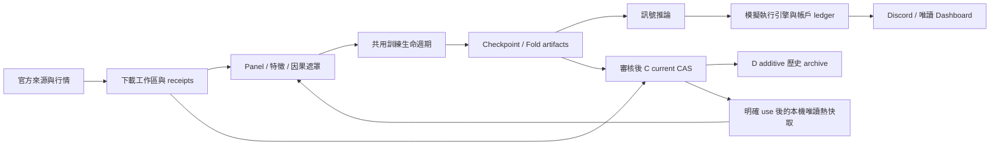

# 專案架構與修改導航

本頁是現行程式責任的導航；細節以連結的實作、解析後設定與 `AGENTS.md` 為準。
Git 分支、執行模式、模型與部署策略是四種不同概念，不能用其中一種代替另一種。

## 第一性原理：系統必須回答的問題

| 問題 | 唯一責任入口 | 輸出／驗收 |
|---|---|---|
| 哪些事實在決策時已可取得？ | `downloader/`、`stockagent/data/` | 原始回應、receipt、因果特徵、coverage |
| 模型可輸出什麼行動？ | `stockagent/models/factory.py`、`stockagent/portfolio_contract.py` | 模型輸出形狀、mask、權重／動作語意 |
| 行動能否成交，帳戶如何變化？ | `stockagent/backtest/` | 商品專屬費用、流動性、部位、結算、破產狀態 |
| 訓練能否恢復與重現？ | `train.py` → `stockagent/training/mode_adapter.py` → shared trainer/lifecycle | checkpoint ABI、fold ownership、完成驗收 |
| 線上誰有寫入權？ | `stockagent/live/`、`services/discord_bot/` | engine ledger/revision；Discord 與 dashboard 各自讀取 |
| 成果如何持久保存與交付？ | `stockagent/data_sync/`、`configs/data_sync/packed_datasets.json` | immutable release、hash、peer convergence、READY |
| 狀態如何被觀察？ | `deploy/systemd/`、dashboard/status receipts | 程序存活、工作成功、資料新鮮與公開端點分別驗收 |



## 模組與組件

| 目錄／入口 | 責任與修改位置 |
|---|---|
| `stockagent/config.py`、`configs/markets/` | 嚴格設定解析、繼承與模式驗證；不要把 ablation/GPU job YAML 當成市場設定載入 |
| `downloader/` | 來源 adapter；共用 `http_transport.py`、`artifact_io.py`、`common.py` 的限流與進度 |
| `stockagent/data/` | Panel、特徵、walk-forward 分割、商品 dataset；缺口不補成市場事實 |
| `stockagent/models/` | factory 與模型族；多基底輸出屬普通輸入特徵 |
| `stockagent/training/` | `trainer.py` 共用數值流程；`lifecycle.py` 管理 artifacts；minute/tick 僅保留商品專屬流程 |
| `stockagent/backtest/` | 損益、交易成本、限制與帳戶狀態；必須與訓練 loss、線上輸出語意對齊 |
| `stockagent/live/` | 資料就緒、訊號與 paper engine、服務狀態、唯讀 dashboard |
| `services/discord_bot/markets/`、`services/discord_bot/models/` | 已部署的模式與模型選擇，連到 config、fold 與 checkpoint |
| `stockagent/data_sync/` | 增量冷庫發布、C rolling retention、D archive、materialization、lease、GC、完成 artifact 維護 |
| `stockagent/research/`、`stockagent/evaluation/`、`explainability*.py` | 研究比較、評估、可解釋性；不另建帳務或 checkpoint 權威 |
| `scripts/`、`deploy/systemd/` | 編排、修復、稽核與部署模板；服務成功仍要核對成果 receipt |
| `stockagent/strategies/` | 目前只是保留的 package，並非策略 registry；策略身分由上述 config/model/fold/模式共同定義 |

模式清單直接取自 `TRAINING_MODE_SPECS`，不要在文件維護第二份硬編碼清單。
每個模式宣告商品、資訊時鐘、執行時鐘、狀態生命週期、終止規則與 runner；特定策略
可能覆寫研究代理的執行語意，因此仍須讀解析後 config 與 checkpoint manifest。
詳見 [共用訓練架構](training_mode_adapter_architecture.md)。

## 服務按責任閱讀

- 行情與資料：`registered-data-*`、`tw-public-*`、`shioaji-*`、`taifex-*`、`openbb-*`。
- 執行：`tw-day-trade-simulation` 與 TAIFEX BidAsk worker 的 paper engine。
- 互動與觀察：`discord-bot`、`public-dashboards`、TAIFEX dashboard、status snapshots。
- 維護：minute curves、eligibility、preopen gate、unattended guardian、Discord artifact maintenance。
- 儲存：packed backup/retention、data cache GC、storage pressure、hot artifact sync、artifact dedup、cold artifact maintenance。

這是責任分類，不是 systemd 啟停 target。需安裝哪些服務取決於節點角色；特別是
`cold-artifact-maintenance` 包含符合條件後的原始 artifact eviction，缺少此 optional
服務不等於應自動開啟刪除政策。

## 可重新產生的 AI 可讀清單

```bash
source scripts/runtime_env.sh
run_fintech_python scripts/audit_project_architecture.py \
  --systemd --output artifacts/project_review/architecture.json
```

清單讀取現有 registry、驗證每份市場 YAML、列出本機 Git refs、資料 catalog、systemd
模板與可選的本機狀態。它不下載資料、不更改分支、不啟停服務，不遍歷大型資料樹。
遠端 refs 是本機已知快照；程序啟動時間不能證明載入的是目前 Git revision。

修改時依序定位「事實來源 → 轉換 → 決策 → 執行 → receipt」，先在擁有該責任的
組件修正，再使用相同路徑的回歸測試。不要因檔案名稱相近就新建平行框架。
